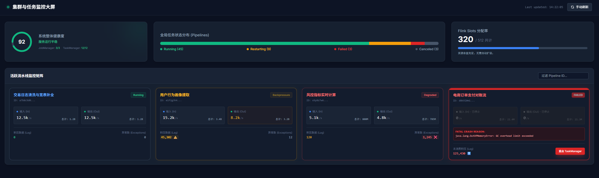
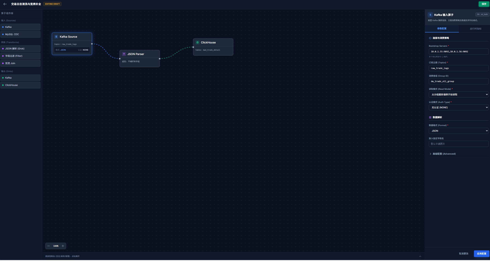
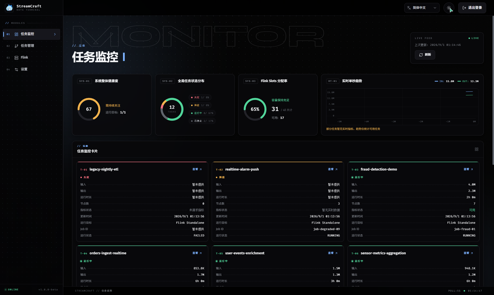
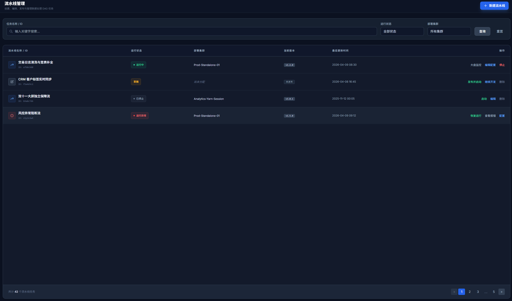

<p align="center">
  
</p>

<h1 align="center">StreamCraft</h1>

<p align="center">
  面向 Apache Flink 的可视化流处理工作台
</p>

<p align="center">
  <a href="README.md">English</a> | 简体中文
</p>

---

## 简介

StreamCraft 把流处理作业的搭建从写代码变成画图：在浏览器 DAG Studio 中拖拽算子、连线成图、配置参数，保存后一键提交到 Flink 集群运行，并通过内置监控页观察作业状态与指标。

整体由两部分组成：

- **service** —— Spring Boot 管理服务，提供 REST API、Thymeleaf 页面与流水线元数据存储
- **core** —— Flink 运行时 JAR，把已保存的流水线定义编译为可执行的 Flink 作业

## 特性

- **可视化 DAG Studio**：拖拽搭图、端口连线、节点级参数配置，右键复制/删除
- **30+ 内置算子**：覆盖 Source / Transform / Sink 三层，从字段级处理到窗口聚合
- **流水线生命周期管理**：保存、预览、运行、停止、删除一站式操作
- **运行时监控**：作业状态、Flink 指标、运行数据实时查看
- **数据库支持**：默认 SQLite 开箱即用，可切换 MySQL

## 截图

<p align="center">
  
  
  
  
</p>

## 快速开始

### 环境要求

- Java 17
- Maven 3.6+
- （可选）Apache Flink Standalone 集群，用于提交运行作业

### 构建

在仓库根目录构建全部模块并生成部署包：

```bash
mvn clean package -DskipTests
```

预期产物：

```text
streamcraft-dist/target/streamcraft-0.2.0-bin.tar.gz
streamcraft-dist/target/streamcraft-0.2.0-bin.zip
```

### 启动

解压部署包后执行启动脚本（Windows 亦可直接运行 `bin\start-service.bat`）：

```bash
bin/start-service.sh
```

启动后访问 <http://localhost:8080>。

### 运行测试

```bash
# core 模块全量测试
mvn -pl core test

# 仅编译 service 及其测试代码
mvn -pl service -DskipTests test-compile
```

## 仓库结构

```text
StreamCraft/
  core/            Flink 运行入口、连接器工厂、转换算子和共享解析代码
  service/         Spring Boot Web 应用、REST API、Thymeleaf 页面和静态前端资源
  streamcraft-dist/  二进制发行包模块（assembly 描述、启动脚本、配置）
  .docs/           架构、接口和算子文档
  .github/docs/assets/  README 截图资源
```

根 `pom.xml` 聚合构建 `core`、`service`、`streamcraft-dist` 三个模块；共享校验与连接器配置解析代码位于 `core/src/shared/java`，同时编译进运行时与服务模块。

## 支持的算子

### Source

| 算子 | 用途 |
|---|---|
| `KAFKA_SOURCE` | 消费 Kafka 记录 |
| `JDBC_SOURCE` | 以全量或增量模式读取关系型数据库数据 |
| `ELASTICSEARCH_SOURCE` | 以全量或增量模式读取 Elasticsearch 文档 |
| `INFLUXDB_SOURCE` | 读取 InfluxDB 时序数据 |
| `HDFS_FILE_SOURCE` | 从 HDFS 读取文件 |

### Transform

| 算子 | 用途 |
|---|---|
| `PUT` / `PRUNE` / `RENAME` | 新增、删除和重命名字段 |
| `DESERIALIZE` / `SERIALIZE` | 解析和序列化记录内容 |
| `FILTER` / `ROUTE` / `CASE_WHEN` | 过滤记录、条件分支和条件派生字段 |
| `CAST` / `EVAL` / `GROK` / `CUSTOM_CODE` | 类型转换、表达式计算、模式提取和自定义 Java 逻辑 |
| `FLATTEN` / `EXPLODE` | 打平嵌套对象，把数组展开为多条记录 |
| `DEDUPLICATE` | 按 key 结合 TTL 或窗口去重 |
| `LOOKUP_ENRICH` / `LOOKUP_JOIN` | 静态维表补全记录或执行查找关联 |
| `STREAM_JOIN` | 通过显式 left/right 输入端口关联两路上游流 |
| `DATA_QUALITY` | 校验必填、类型、范围、枚举和正则规则 |
| `TIME_DERIVE` | 解析、格式化、转换和派生时间分区字段 |
| `MASK_HASH` | 写入下游前对敏感值脱敏或哈希 |
| `AGGREGATE` | 计数/时间窗口上的 count、sum、min、max、avg、count distinct、first/last、top N、collect list/set |

### Sink

| 算子 | 用途 |
|---|---|
| `KAFKA_SINK` | 写入 Kafka |
| `JDBC_SINK` | 写入关系型数据库 |
| `ELASTICSEARCH_SINK` | 写入 Elasticsearch 文档 |
| `INFLUXDB_SINK` | 写入 InfluxDB 点数据 |
| `HDFS_FILE_SINK` | 写入 HDFS 文件 |

> 流水线边使用语义端口：普通算子为 `records`；Filter 为 `matched` / `rejected`；Data Quality 为 `clean` / `dirty`；Stream Join 为 `left` / `right`；Route 输出端口由路由配置决定。

## 配置

常用配置项（`conf/application.properties`）：

| 配置项 | 默认值 | 说明 |
|---|---|---|
| `server.port` | `8080` | HTTP 端口（可用环境变量 `SERVER_PORT` 覆盖） |
| `streamcraft.datasource.type` | `sqlite` | 数据库类型：`sqlite` 或 `mysql` |
| `spring.datasource.url` | `jdbc:sqlite:streamcraft-service.db` | 数据库连接 URL |
| `spring.jpa.hibernate.ddl-auto` | `validate` | Flyway 管理结构，Hibernate 仅校验 |
| `spring.datasource.hikari.maximum-pool-size` | `1` | 数据库连接池大小 |
| `streamcraft.auth.remember-me-validity-seconds` | `1209600` | 记住登录 Cookie 有效期（秒） |
| `streamcraft.internal.token` | `streamcraft-local-internal-token` | 内部服务调用保护 token |
| `logging.file.name` | `./logs/streamcraft-service.log` | 日志文件路径 |
| `streamcraft.flink.core-jar-path` | `../core/target/streamcraft-core.jar` | Core JAR 路径 |
| `streamcraft.flink.connect-timeout` | `2s` | Flink REST 连接超时 |
| `streamcraft.flink.read-timeout` | `3s` | Flink REST 读取超时 |
| `streamcraft.runtime-target.validation-interval` | `5000` | 运行目标健康检查间隔（毫秒） |
| `streamcraft.pipeline.runtime.service-base-url` | `http://localhost:8080` | Flink 作业回访 Service 的基础 URL |
| `streamcraft.pipeline.runtime.parallelism` | `1` | 默认流水线并行度 |

### 切换 MySQL

```bash
export STREAMCRAFT_DATASOURCE_TYPE=mysql
export STREAMCRAFT_DATASOURCE_URL='jdbc:mysql://localhost:3306/streamcraft?useUnicode=true&characterEncoding=utf8&serverTimezone=UTC'
export SPRING_DATASOURCE_USERNAME=streamcraft
export SPRING_DATASOURCE_PASSWORD=streamcraft
bin/start-service.sh
```

数据库结构由 Flyway 迁移管理：全新数据库执行初始迁移，已有数据库先建立 baseline 再执行后续迁移。**升级前请备份数据库。**

## 部署包结构

```text
streamcraft-<version>-bin/
  bin/            start/stop/status 脚本（sh 与 bat）及 streamcraft-env.sh
  conf/           application.properties
  libs/           streamcraft-service-<version>.jar 及依赖
  flink-libs/     streamcraft-core.jar
  logs/           运行日志
  data/           数据库文件
  docs/           README.md / README_CN.md
```

## 主要页面

| 路径 | 页面 |
|---|---|
| `/login` | 登录 |
| `/main` | 概览 |
| `/pipelines` | 流水线列表 |
| `/pipelines/{id}/monitor` | 流水线监控详情 |
| `/studio` | 新建流水线 |
| `/studio/{id}` | 编辑流水线 |
| `/runtime-target` | Flink 运行目标 |
| `/settings` | 账号设置 |

## 主要 API

| 方法 | 路径 | 用途 |
|---|---|---|
| `POST` | `/api/pipelines` | 保存流水线 |
| `GET` | `/api/pipelines` | 流水线列表 |
| `GET` | `/api/pipelines/{id}` | 流水线详情 |
| `GET` | `/api/pipelines/{id}/definition` | 运行时流水线定义 |
| `POST` | `/api/pipelines/preview` | 预览流水线 |
| `POST` | `/api/pipelines/{id}/run` | 运行流水线 |
| `POST` | `/api/pipelines/{id}/stop` | 停止流水线 |
| `DELETE` | `/api/pipelines/{id}` | 删除流水线 |
| `GET` | `/api/pipelines/{id}/metrics` | 查询 Flink 指标 |
| `GET` | `/api/pipelines/monitor` | 全局任务监控数据 |
| `GET` | `/api/overview` | 概览统计 |
| `GET` | `/api/runtime-target` | 查询 Flink 目标 |
| `PUT` | `/api/runtime-target/standalone` | 保存 Flink 目标 |
| `POST` | `/api/settings/password` | 修改管理员密码 |

## 许可证

[Apache License 2.0](LICENSE)
